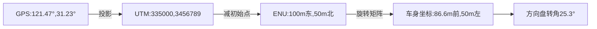

# Day 5: 核心架构：感知 → 定位 → 决策 → 控制


**《机器人の求生指南：从智障到智能の四步修炼法》**

---

### 🌍 **核心架构の哲学：像外卖小哥一样思考**
假设你是一台送外卖的机器人，接到订单后的心路历程：
```
1. 感知：发现前方有只拦路橘猫（视觉）
2. 定位：确认自己没骑到绿化带上（GPS）
3. 决策：选择从花坛边绕行（路径规划）
4. 控制：精准控制车头转角27.3度（执行）
```

---

### 👁️ **第一重：感知篇 - 机器人的五感暴走**
**传感器全家桶**：
- **摄像头**：24K钛合金狗眼（但夜盲）
- **激光雷达**：每秒发射10万个激光点（费电如喝水）
- **毫米波雷达**：雨雪天最后的尊严（但分不清井盖和减速带）
- **超声波**：倒车时的碎碎念（"嘀~嘀~嘀"）

```python
# 伪代码：融合多传感器就像调火锅蘸料
def 感知世界():
    视觉数据 = 摄像头.捕获()           # 拍到了疑似UFO的塑料袋
    点云数据 = 激光雷达.扫描()         # 发现前方有不明隆起物
    毫米波数据 = 雷达.检测()           # 检测到移动物体（其实是落叶）
    最终结论 = 投票系统([视觉数据, 点云数据, 毫米波数据])  # 少数服从多数
    return 最终结论  # 大概率误判
```

**经典翻车现场**：
- 把夕阳反光当成红灯（视觉误判）
- 把路边广告牌上的汉堡当成真汉堡（CV目标检测翻车）
- 在隧道里丢失GPS信号后开始怀疑人生（定位丢失）

---

### 🧭 **第二重：定位篇 - 我是谁？我在哪？**
**定位三件套**：
1. **GNSS**：室外勉强可用（误差3米=可能骑进河里）
2. **IMU**：内置戏精，总觉得自己在加速（陀螺仪漂移）
3. **SLAM**：一边走一边画地图（像蒙眼摸象）

```cpp
// 伪代码：卡尔曼滤波的自我催眠
void 灵魂拷问() {
    while(true) {
        预测位置 += 速度 * 时间 + IMU.get玄学数据();
        观测位置 = GPS.get薛定谔坐标();
        最终位置 = 卡尔曼滤镜(预测位置, 观测位置); // 假装自己很准
    }
}
```

**生存技巧**：
- 看到消防栓就贴脸开大（人工路标辅助定位）
- 遇到玻璃幕墙自动进入贤者模式（防止激光雷达被骗）
- 每走10米就找棵树对拳（闭环检测校正）

---

### 🧠 **第三重：决策篇 - 选择困难症晚期**
**决策层の日常精神内耗**：
```
if 前方有行人:
    if 行人正在玩手机:
        if 手机是iPhone:
            减速概率 += 30%  # 果粉可能更专注？
    elif 行人牵着狗:
        if 狗是柯基:
            绕行半径 -= 0.5m  # 腿短跑得慢？
else:
    继续播放《速度与激情》BGM
```

**路径规划の千层套路**：
```python
def 选择路线():
    A*算法路径 = 找最短路线()          # 会穿过广场舞大妈方阵
    RRT算法路径 = 随机撒点路线()       # 走出六亲不认的步伐 
    人工势场路径 = 绕开所有障碍物()    # 最终走出心电图轨迹
    return 综合决策(怂的程度系数)     # 通常选择最怂的方案
```

**经典矛盾场景**：
- 遵守交规（停车礼让） vs 准时送达（平台超时罚款）
- 保护行人（急刹） vs 保护奶茶（防止泼洒）

---

### 🕹️ **第四重：控制篇 - 脑：明白了 手：你明白个鬼**
**控制闭环の相爱相杀**：
```
理想：以2m/s匀速前进，路径跟踪误差<5cm
现实：电机发热后开始摆烂，误差逐渐狂野
```

**PID控制の玄学调参**：
```python
class 灵魂车手:
    def __init__(self):
        self.Kp = 0.3  # 猛男系数
        self.Ki = 0.1  # 记仇系数 
        self.Kd = 0.05 # 预见未来系数
  
    def 控制方向盘(self, 当前偏差):
        调节量 = (self.Kp * 当前偏差 
                + self.Ki * 累计偏差 
                - self.Kd * 未来偏差猜测)  # 猜错是常态
        方向盘.拧动(调节量)  # 结果可能画龙
```

**翻车名场面**：
- 刹车力度过大导致奶茶飞出（控制超调）
- 转弯时左右轮转速不同步（开始转圈圈）
- 遇到结冰路面开始跳街舞（失去摩擦力）

---

### 🌀 **四层架构の量子纠缠**
**数据流动の奇妙冒险**：
```
感知层："检测到前方有物体！"
定位层："但我们正在高架桥下..."
决策层："按概率70%是阴影，继续前进！"
控制层："已踩油门...等等那好像是真人！"
—— 系统日志记录《生死时速》 
```

**延迟の蝴蝶效应**：
- 感知延迟100ms → 定位漂移10cm → 决策误判 → 控制撞墙
- 解决方法：把整个系统加速到1ms内响应（然后芯片冒烟）

---

### 🤖 **机器人工程师の终极觉悟**
1. 感知层永远觉得传感器不够用（想要章鱼博士的配置）
2. 定位层日常在"准"和"能跑就行"之间仰卧起坐
3. 决策层的if-else比《百年孤独》的人物关系还复杂
4. 控制层最终发现不如直接焊死方向盘

**宇宙真理**：
所有优雅的算法最终都会向硬件性能低头，就像所有理想最终都会向甲方需求低头。

---

**课后实践**：
1. 用扫地机器人实践"看见猫→避开猫→被猫骑"的完整流程
2. 在停车场复现"定位漂移→以为在B2→实际在B3"的恐怖片场景
3. 尝试把决策系统训练成《头文字D》的拓海风格

（附加题：当老板说"这不就是个自动行走的冰箱吗"，请优雅地打开ROS2的DDS配置文档）

## Part II: 传感器专题：LiDAR/相机/IMU/GPS的时间同步


**《传感器乐队调音指南：让LiDAR、相机、IMU、GPS齐奏交响乐》**

---

### ⏱️ **时间同步の本质：给各传感器配同一块表**
想象你在指挥一场多乐器合奏：
- **LiDAR**：慢节奏低音鼓（10Hz）
- **相机**：中速钢琴（30Hz）
- **IMU**：疯狂架子鼓（200Hz）
- **GPS**：迟到的小提琴手（1Hz）

**翻车现场**：激光雷达拍到行人时，相机还在拍上一帧的树（时间差导致目标关联失败）

---

### 🔧 **硬件级同步：给乐队装节拍器**
**方案1：PTP精准时间协议（土豪版）**
- 原理：主时钟通过网线广播时间（精度±1微秒）
- 效果：各传感器时间戳误差≈人类眨眼速度的1/1000
- 缺点：需要支持PTP的交换机（价格≈一个月奶茶钱）

**方案2：GPS脉冲授时（户外版）**
- 原理：GPS每秒发送1个PPS脉冲（像心跳起搏器）
```python
# 伪代码：GPS脉冲触发全家桶
while True:
    wait_for_gps_pulse()  # 等那个神圣的脉冲
    camera.capture()       # 咔嚓
    lidar.rotate()         # 滋——
    imu.reset_counter()    # 从零开始计数
```

**方案3：硬件触发线（复古版）**
- 操作：用物理线缆连接所有设备的Trigger接口
- 效果：同步精度±100微秒（约等于手动同时按下所有开关）
- 经典问题：线材老化导致相机比LiDAR晚触发（仿佛音响接触不良）

---

### 🖥️ **软件级同步：后期给录音对齐节奏**
**核心思路**：记录每颗音符的准确时间，后期用算法对齐

**时间戳管理四部曲**：
1. **统一时钟源**：选一个主时钟（通常选工控机系统时间）
2. **记录偏差**：测量每个传感器的时钟偏移（像时差表）
   ```python
   # 测量IMU时钟偏差
   imu_time = imu.get_timestamp()
   system_time = time.time()
   imu_time_offset = system_time - imu_time  # 记在小本本上
   ```
3. **插值大法**：高频数据（IMU）给低频数据（GPS）当参考
   ```cpp
   // 当GPS数据迟到时，用IMU数据插值
   double gps_time = get_gps_timestamp(); 
   auto imu_data = imu_buffer.get_nearest(gps_time); // 找最近邻IMU数据
   ```
4. **滑动窗口对齐**：把不同传感器数据装进时间对齐的"篮子"
   ```python
   time_window = 0.02  # 20ms容忍窗口
   aligned_data = []
   for cam_data in camera_stream:
       lidar_data = lidar_buffer.get(cam_data.timestamp ± time_window)
       imu_datas = imu_buffer.get_range(cam_data.timestamp, cam_data.timestamp+0.1)
       aligned_data.append( (cam_data, lidar_data, imu_datas) )
   ```

---

### 🕶️ **各传感器の时间特性（摸鱼程度排名）**
| 传感器 | 频率    | 延迟       | 抖动量     | 吐槽                 |
|--------|---------|------------|------------|----------------------|
| IMU    | 200Hz   | 1ms        | ±0.1ms     | 卷王，但数据像喝多了 |
| LiDAR  | 10Hz    | 50ms       | ±5ms       | 慢性子但精确         |
| 相机   | 30Hz    | 33ms       | ±10ms      | 主唱，总觉得自己最靓 |
| GPS    | 1Hz     | 1000ms     | ±200ms     | 兼职选手，经常掉线   |

---

### 📦 **数据缓存策略：时间对齐の收纳艺术**
**环形缓冲区设计**（像回转寿司传送带）：
```cpp
template<typename T>
class TimeSyncBuffer {
public:
    void add_data(T data) {
        std::lock_guard<std::mutex> lock(mutex_);
        buffer_.push_back(data);
        if(buffer_.size() > 1000) {  // 防止吃太多内存
            buffer_.pop_front(); 
        }
    }

    std::optional<T> get_data(double timestamp) {
        auto it = std::lower_bound(buffer_.begin(), buffer_.end(), timestamp, 
            [](const auto& d, double t) { return d.timestamp < t; });
        if(it != buffer_.end() && abs(it->timestamp - timestamp) < 0.01) {
            return *it;
        }
        return std::nullopt;
    }

private:
    std::deque<T> buffer_;
    std::mutex mutex_;
};
```

**插值策略选择指南**：
- **最近邻插值**：适合突发数据（如激光雷达突然检测到障碍）
- **线性插值**：适合IMU这种高频率平滑数据
- **样条插值**：追求极致精度（但计算量可能让CPU冒烟）

---

### 🚨 **常见翻车现场与甩锅指南**
**事故1：相机和LiDAR时间戳对不上**
- **检测**：画时间戳散点图，发现两者呈斜线分布
- **甩锅**："肯定是相机的FPGA时钟源有问题！"
- **解决**：重校准时间偏移量，加入温度补偿（因为芯片发热会改变时钟速度）

**事故2：GPS时间戳突然跳跃**
- **检测**：连续两个GPS时间戳间隔不是1秒±10%
- **甩锅**："卫星信号被外星人干扰了！"
- **解决**：启用IMU+轮速计的组合导航作为备份

**事故3：IMU数据时间戳出现重复**
- **检测**：发现相邻IMU数据时间差为0
- **甩锅**："IMU的驱动程序员该扣鸡腿！"
- **解决**：在数据接收端添加时间戳去重过滤器

---

### 🔍 **调试技巧：给时间线做CT扫描**
**可视化工具**：
1. **时间戳分布直方图**：看各传感器数据是否均匀分布
2. **滑动窗口对齐率统计**：计算在20ms窗口内能对齐的数据比例
3. **跨传感器事件测试**：同时触发闪光灯和激光雷达旋转，检查数据时间戳是否重合

**实战代码（Python示例）**：
```python
def plot_time_sync(cam_times, lidar_times, imu_times):
    plt.figure(figsize=(12,6))
    plt.scatter(cam_times, [1]*len(cam_times), label='Camera', alpha=0.3)
    plt.scatter(lidar_times, [2]*len(lidar_times), label='LiDAR', alpha=0.3)
    plt.scatter(imu_times, [3]*len(imu_times), label='IMU', alpha=0.1)
    plt.yticks([1,2,3], ['Camera', 'LiDAR', 'IMU'])
    plt.title("传感器时间戳分布（理想情况应垂直对齐）")
    plt.show() 

# 运行结果可能类似星际迷航的舰炮齐射画面
```

---

### 🤖 **工程师の觉悟**
1. 永远不要相信传感器厂商说的"我们的设备支持精确时间同步"
2. 准备至少三种时间同步方案（因为总有一种会在现场失效）
3. 在代码里埋时间一致性检查（像汽车的安全带）
4. 当所有方法都失败时..考虑重启设备（玄学大法好）

**终极哲学**：
时间同步的尽头，是对硬件原理的深刻理解和对不完美世界的妥协。就像爱情，总要学会在时差中寻找默契。

---

**课后作业**：
1. 用树莓派同时连接USB相机和IMU模块，实现±10ms级同步
2. 在KITTI数据集上复现激光雷达与相机的时空标定错误
3. 当发现GPS时间戳延迟超过2秒时，自动切换备胎时钟源

（附加题：当产品经理说"加个WiFi同步功能就行了吧"，请优雅地打开IEEE 1588协议白皮书）


## Part III: 坐标系转换：ENU/UTM/车身坐标的相互转换


**《坐标系の宫斗大戏：ENU、UTM、车身坐标的爱恨情仇》**

---

### 🌐 **坐标系の角色卡**
**ENU（东-北-天）**
- 人设：傲娇的本地贵族
- 口头禅："以我为中心，方圆百米我说了算！"
- 技能：快速计算相对位置，但容易遗忘出身

**UTM（通用横轴墨卡托）**
- 人设：严谨的皇家书记官
- 口头禅："整个地球都被我切成了60个豆腐块"
- 技能：全球统一编号，但拼接处有微妙误差

**车身坐标（前-左-上）**
- 人设：自恋的霸道总裁
- 口头禅："我的车头方向就是世界的正方向！"
- 技能：秒懂方向盘转角，但路痴晚期

---

### 🧭 **第一幕：GPS到UTMの登基大典**
**场景**：收到GPS的WGS84坐标（纬度：31.23°，经度：121.47°）
**操作**：把这个球面坐标塞进UTM的方形豆腐块

```python
from pyproj import Proj

# 上海位于UTM第51带（带号计算：经度+180)//6 → (121.47+180)/6≈50.245 → 51区）
utm_proj = Proj(proj='utm', zone=51, ellps='WGS84')
x, y = utm_proj(121.47, 31.23)  # 输出：x=335000m，y=3456789m（近似值）

# 隐藏剧情：跨UTM带时的宫斗（需要重投影计算）
```

**翻车预警**：
- 在UTM带边缘地区（如经度177°），误差会突然黑化
- 高海拔地区需要启用"高度修正"技能

---

### 🚗 **第二幕：UTM到ENUの领土划分**
**场景**：以上海人民广场为原点（初始点：31.23, 121.47）建立ENU坐标系
**操作**：把UTM坐标转换为本地东-北-天坐标

```cpp
struct ENU {
    double east;  // 东
    double north; // 北
    double up;    // 天（高程）
};

ENU utm_to_enu(double ref_x, double ref_y, double ref_z, 
               double target_x, double target_y, double target_z) {
    ENU result;
    result.east = target_x - ref_x;          // 简单减法
    result.north = target_y - ref_y;      
    result.up = target_z - ref_z;         
    return result;  // 忽略了地球曲率（50km内误差可接受）
}
```

**宫斗潜规则**：
- 超出50km范围需启动"平面投影修正"（余弦修正）
- 高程变化剧烈地区（如重庆）需额外俯仰角补偿

---

### 🏎️ **第三幕：ENU到车身坐标の霸道总裁变形记**
**场景**：车辆航向角30°，将ENU坐标转换到以车头为X轴的坐标系
**操作**：用旋转矩阵完成坐标系夺舍

```python
import numpy as np

def enu_to_body(enu_point, yaw_deg):
    yaw = np.radians(yaw_deg)
    rotation_matrix = np.array([
        [np.cos(yaw), np.sin(yaw), 0],  # 东方向投影到车头
        [-np.sin(yaw), np.cos(yaw), 0], # 北方向投影到左侧
        [0, 0, 1]                       # 天方向保持不变
    ])
    body_point = np.dot(rotation_matrix, enu_point)
    return body_point  # 现在坐标以车头为X轴，左侧为Y轴

# 示例：ENU坐标(10米东, 5米北) → 车头方向30度时
print(enu_to_body([10,5,0], 30))  # 输出≈[11.83, -1.34, 0]
```

**翻车名场面**：
- 忘记角度单位转换（弧度vs度数）导致车体坐标系旋转90度
- 车身侧倾时未加入横滚角补偿（把立交桥当成平面）

---

### 🔄 **第四幕：三位一体的循环转换**
**完整流程**：GPS→UTM→ENU→车身坐标→控制指令


**数据穿越时空的代价**：
- 每次转换损失约0.1%精度（像复印件的复印件）
- 100次转换后误差可能累计超过10%（需定期原点重置）

---

### 🧩 **坐标系の办公室政治**
**ENU的抱怨**：
"每次都要以我为跳板，但最后功劳都被车身坐标抢走！"

**UTM的反击**：
"没有我的全局视野，你们连自己在哪里都不知道！"

**车身坐标的傲娇**：
"哼，你们这些大地坐标系根本不懂实时控制的需求！"

**和事佬解决方案**：
- 每10秒用GPS原始数据重新校准原点（像定期团建）
- 在SLAM系统中建立以车辆为中心的局部地图（搞小团体）

---

### 🛠️ **避坑指南：坐标系转换の九阴真经**
1. **顺序敏感**：先旋转后平移 vs 先平移后旋转（误差相差一个车身长度）
2. **左手vs右手**：突然发现Z轴方向反了（像镜子里的世界）
3. **单位统一**：UTM用米，GPS用度，IMU用弧度（单位换算暗杀事件）
4. **实时性考验**：转换耗时超过控制周期时，启用预测算法（占星术模式）

```cpp
// 错误示范：混合使用不同顺序
// 正确做法：遵循ISO标准（平移→旋转→缩放）
Eigen::Vector3d point_utm = ...;
Eigen::Vector3d point_enu = point_utm - initial_utm;  // 先平移
Eigen::Matrix3d R = get_rotation_matrix(yaw);         // 再旋转
Eigen::Vector3d point_body = R * point_enu;           // 得到车身坐标
```

---

### 🤯 **终极哲学：坐标系の相对论**
当你在转换坐标系时：
- **自动驾驶视角**：万物皆可转换为以我为中心
- **上帝视角**：所有坐标系都是人为定义的虚拟牢笼
- **打工人视角**：又要加班调试坐标转换的玄学Bug了

**宇宙真理**：
完美的坐标系转换只存在于理论中，实际项目里能用就行。就像人生，总要带着误差前行。

---

**课后作业**：
1. 用Python实现GPS到车身坐标的完整转换链条（允许误差±1米）
2. 在Unity里可视化展示坐标转换漂移现象（建议配乐《天旋地转》）
3. 当发现转换误差超过阈值时，自动触发"老板，这需求有问题"表情包

（附加题：当产品经理说"加个AR导航，把虚拟路牌投影到真实世界"，请优雅地打开《多传感器时空统一标定白皮书》）